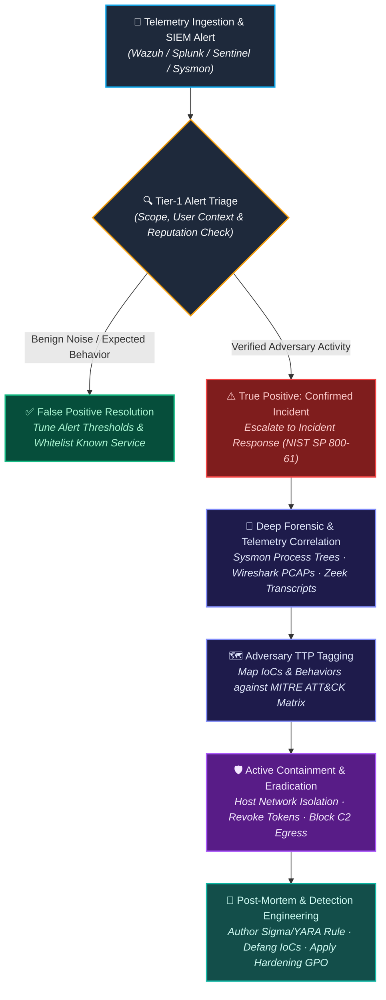

<div align="center">

<!-- Cyber Telemetry Dynamic Header Banner -->


<!-- Dynamic Typing Subtitle -->
<a href="https://charming-squirrel-bcff68.netlify.app/">
  
</a>

<p align="center">
  <a href="https://charming-squirrel-bcff68.netlify.app/">
    
  </a>
  <a href="https://github.com/icebergf6">
    
  </a>
  <a href="https://linkedin.com/">
    
  </a>
  <a href="mailto:analyst.leosyafiq.soc@proton.me">
    
  </a>
  <a href="https://tryhackme.com">
    
  </a>
</p>

<p align="center">
  
  
  
</p>

</div>

---

## ⚡ Operational Status & Identity

```yaml
soc_operator:
  handle: icebergf6
  name: Muhammad Syafiq
  operational_role: "SOC Analyst (Tier-1 / Tier-2) · Detection & Incident Triage"
  time_zone: "Asia/Jakarta (UTC+7) [Open to Global / Remote Work]"
  primary_mission: "Drive down MTTD/MTTR by transforming raw multi-source telemetry into high-fidelity detections."
  
  core_frameworks:
    - "MITRE ATT&CK (Adversary TTP Mapping & Threat Hunting)"
    - "NIST SP 800-61 Rev. 2 (Computer Security Incident Handling)"
    - "Cyber Kill Chain (Lockheed Martin)"
    - "MITRE D3FEND (Countermeasure & Hardening Matrix)"
    
  tactical_competencies:
    - "Multi-Tenant SIEM/XDR Alert Engineering & False Positive Tuning"
    - "Endpoint Forensics: Sysmon, Windows EVTX (4624/4625/4688/4769), Linux auth.log"
    - "Network Protocol Dissection: Wireshark PCAP carving, Zeek conn/ssl/dns logs"
    - "Threat Intel & Defanging: VirusTotal API, AbuseIPDB, Any.Run Sandbox Analysis"
    - "AppSec Hardening: OWASP Top 10, Row-Level Security, BOLA/IDOR Mitigation"
```

---

## 🎯 Certifications & Verified Credentials

<div align="center">

| Credential | Issuing Body | Specialization / Focus | Status |
| :--- | :--- | :--- | :---: |
| **Blue Team Level 1 (BTL1)** | Security Blue Team | Incident Response, Digital Forensics, SIEM, Phishing | **Active** |
| **CompTIA Security+ (SY0-701)** | CompTIA | Core Infosec, Threat Intelligence & Risk Mitigation | **Active** |
| **SC-200: Security Operations Analyst** | Microsoft | Microsoft Sentinel, KQL & Defender XDR Engineering | **Active** |
| **Splunk Core Certified Power User** | Splunk | Complex SPL Searches, Event Correlation & Alert Tuning | **Active** |
| **Top 5% Global Ranking** | TryHackMe | Practical Blue Team Labs, Threat Hunting & Windows Triage | **Verified** |
| **Sherlocks & Blue Track Labs** | Hack The Box | Memory Forensics, Compromised Linux/AD Investigations | **Verified** |

</div>

---

## 🔬 Incident Response & Triage Pipeline

Defensive workflow executing high-fidelity verification, forensic correlation, and rapid containment:



---

## 🧰 Security Operations Stack & Technical Arsenal

### 🔍 SIEM, XDR & Log Management
<p>
  
  
  
  
  
  
</p>

### 📡 Network Forensics & Deep Packet Inspection
<p>
  
  
  
  
  
</p>

### ⚔️ Threat Intelligence, DFIR & Detection Rules
<p>
  
  
  
  
  
  
</p>

### 💻 Automation, Scripting & Secure Engineering
<p>
  
</p>

---

## 🏠 Defensive Homelab Architecture & Threat Range

A virtualized enterprise environment deployed to simulate real-world attacks via **Atomic Red Team** and validate detection coverage:

```text
 ┌──────────────────────────────────────────────────────────────────────────┐
 │                        WAN / INTERNET SIMULATION                         │
 └────────────────────────────────────┬─────────────────────────────────────┘
                                      │
                         ┌────────────▼────────────┐
                         │   pfSense CE 2.7.2 FW   │  (VLAN Isolation, Suricata IDS,
                         │   Perimeter Inspection  │   Filterlog Syslog Export)
                         └──────┬────────────┬─────┘
                                │            │
            ┌───────────────────┘            └────────────────────┐
            ▼                                                     ▼
┌───────────────────────┐                             ┌───────────────────────┐
│  DMZ / ATTACK TARGET  │                             │  ENTERPRISE LAN (AD)  │
│  - Ubuntu Jump Host   │                             │  - Win Server 2022 DC │
│  - Nginx Reverse Prox │                             │  - Win 11 Pro Client  │
│  - Wazuh Agent        │                             │  - Sysmon 15 + Winlog │
└───────────┬───────────┘                             └───────────┬───────────┘
            │                                                     │
            └─────────────────────────┬───────────────────────────┘
                                      ▼
                        ┌───────────────────────────┐
                        │   SECURITY OPS / SIEM     │
                        │   - Wazuh Manager 4.x     │
                        │   - Splunk Enterprise     │
                        │   - Zeek Sensor (TAP)     │
                        │   - Elasticsearch + Kibana│
                        └───────────────────────────┘
```

---

## 📁 Key Technical Repositories & Security Projects

### 🛡️ [soc-analyst-portfolio](https://github.com/icebergf6/soc-analyst-portfolio)
**Enterprise Defensive Security Showcase, SIEM Sandbox & Homelab Documentation**
- **Live Demo**: [charming-squirrel-bcff68.netlify.app](https://charming-squirrel-bcff68.netlify.app/)
- **Core Highlights**:
  - Interactive browser-based SIEM sandbox testing real queries across Windows EVTX, Sysmon, and Linux logs.
  - Full incident reconstructions with real queries: Wazuh Rule `100055`, Splunk SPL correlation, and Sentinel KQL.
  - Network packet dissector analyzing extracted Cobalt Strike beaconing streams with timing delta & jitter calculations.
- **Tech Stack**: `Next.js`, `TypeScript`, `Tailwind CSS`, `Splunk SPL`, `Wazuh XML`, `Wireshark DPI`.

### 💬 [TelegramKW](https://github.com/icebergf6/TelegramKW)
**Ephemeral Real-Time Messaging Platform with Zero-Trace Architecture**
- **Security Highlights**:
  - Engineered for ephemeral communication with no persistent message retention.
  - Strict input sanitization preventing Stored XSS and SQL injection payloads.
  - Database-enforced **Row-Level Security (RLS)** via Supabase preventing unauthorized data traversal.
- **Tech Stack**: `Next.js`, `React`, `Supabase`, `WebSockets`, `Secure Authentication`.

### 📊 [TrustFlow_Biz](https://github.com/icebergf6/TrustFlow_Biz)
**Secured Financial & Credit Ledger System (BOLA/IDOR Hardened)**
- **Security Highlights**:
  - Multi-tenant data segregation with rigorous cryptographic session validation.
  - Full mitigation against **Broken Object Level Authorization (OWASP API1:2023)**.
  - Append-only financial audit trails for fraud tracking and tamper-evident accounting.
- **Tech Stack**: `React`, `TypeScript`, `Tailwind CSS`, `Supabase Auth & PostgreSQL`.

---

## 📝 Documented Incident Investigations & Case Studies

| Incident Title | Vector / Technique | Primary Telemetry | Key Findings & Remediation |
| :--- | :--- | :--- | :--- |
| **Cobalt Strike C2 Beaconing** | `T1071.001` (Web C2) | Wireshark PCAP · Zeek `conn.log` | Discovered low-and-slow HTTPS beaconing disguised with 60s interval (+/-10% jitter). Blocked C2 IP and revoked compromised session tokens. |
| **SSH Brute-Force & Lateral Pivot** | `T1110` (Brute Force) · `T1021.004` (SSH) | Wazuh Alert `5710` · Linux `auth.log` | 4,200+ failed SSH authentications followed by successful login and lateral movement attempt. Implemented IP fail2ban and key-only PAM policy. |
| **Malicious Macro & LOLBins Execution** | `T1204.002` (Malicious File) · `T1059.001` (PowerShell) | Sysmon EID 1 · WinEvent 4104 | Detected `WINWORD.EXE` spawning obfuscated `powershell.exe` download cradle. Deployed ASR rules blocking Office child process spawns. |
| **HTB Sherlocks: Brutus Forensics** | `T1078` (Valid Accounts) · `T1070` (Indicator Removal) | Linux `auth.log` · `wtmp` · `btmp` | Reconstructed attacker timeline on compromised Linux host, pinpointed unauthorized user addition, and restored tampered logs. |

---

## 📈 Activity, Telemetry & Code Metrics

<div align="center">


</div>

<div align="center">


</div>

---

<div align="center">

### 🔒 Verify · Monitor · Analyze · Contain · Harden
<sub>Ethical security practitioner operating strictly within isolated cyber ranges, authorized engagements, and RFC-compliant environments.</sub>

<br/>

```bash
# Import PGP Public Key for Encrypted Communications
curl -s https://charming-squirrel-bcff68.netlify.app/pgp.asc | gpg --import
```

<p>
  <sub>© Muhammad Syafiq (<code>icebergf6</code>) — All rights reserved.</sub>
</p>

</div>
